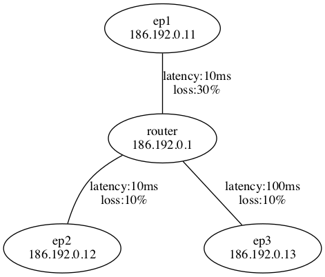

# Testbed

In this assignment, you will create a networking testbed using the
`ip2` suite and network namespaces. We will use this testbed in later
assignments, and it will give you a template for similar testbeds that
you might find useful when developing networked applications during
your career.

## Properties

Your testbed will have the following properties:

 * A central node will act as a router, providing forwarding between
   multiple endpoints.
 * The endpoints will be able to communicate with one another.
 * Each node, including both the router and endpoints, will operate in
   its own network namespace.
 * Individual router-endpoint links can have latency and packet loss
   as specified below.

## Details

You will provide the following files:

 * `start_testbed.sh` -- This script creates the testbed.
 * `stop_testbed.sh` -- This destroys a running testbed.

The network within your testbed will conform to a CIDR (Classless
Inter-Domain Routing) *netblock*. This is specified as a *base
address* and a *prefix length*. The base address is in *dotted quad*
notation, that is four numbers between 0 and 255 (inclusive),
separated by dots. This is equivalent to a 32-bit integer. The prefix
length is a number between 0 and 32 (inclusive), and it specifies how
many bits of the base address are used to uniquely identify this
network. The netblock is represented as `<base address>/<prefix length>`.

For example an IP address `84.138.61.197` in a network with a prefix
length of 24 would be part of the netblock `84.138.61.0/24`, because
24 bits is 3 bytes (or, more technically, *octets*), so the last octet
is free to have any value. Since the smallest value for an octet is 0,
that's what we use in the netblock's address.

Your testbed should have the following configuration:
 * The router node should be in the `router` namespace, and have
   an IP address of `186.192.0.1`
 * There should be three endpoints:
   1. The first should have namespace `ep1`, IP address `186.192.0.11`,
      and *bidirectional* latency 10ms and packet loss 30%.
   2. The second should have namespace `ep2`, IP address `186.192.0.12`,
      and *bidirectional* latency 10ms and packet loss 10%.
   1. The third should have namespace `ep3`, IP address `186.192.0.13`,
      and *bidirectional* latency 100ms and packet loss 10%.
 * The testbed network itself has a CIDR block `186.192.0.0/16`

This configuration is shown in the following diagram:
 *Network created by the above configuration*

Each endpoint should forward packets for the entire `186.192.0.0/16`
subnet to the router.

You may create whatever additional scripts you might need to call from
`start_testbed.sh` and `stop_testbed.sh`. All of the files needed to
run your testbed (the start/stop scripts and any additional scripts)
must be added, committed, and pushed to gitlab. Please ensure that any
scripts which must be executable have been set as such in a way that
git recognizes.

## Submission

Your files must be pushed to gitlab.cs.umd.edu by the deadline to
receive credit.

## Outcomes

Your grade for this assignment will be determined by the following
criteria. Each higher grade must satisfy all of the grades below it,
so to receive an A, you must satisfy all three sets of criteria.

**C** The `start_testbed.sh` script creates a testbed with the correct
star topology, with all of the expected links.

**B** The testbed is able to forward traffic between arbitrarily
selected endpoints, and all nodes are in their own namespaces.

**A** The latencies and packet losses behave correctly for all links,
and the `stop_testbed.sh` script correctly cleans up all of the
namespaces and links.
